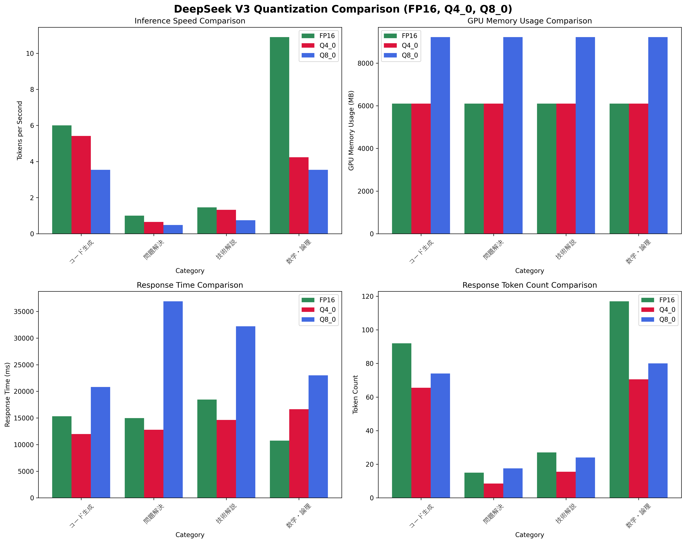

# DeepSeek V3 量子化比較研究

> **外付けGPU 16GB環境における INT4 vs INT8 量子化の性能・品質比較**

[](https://www.nvidia.com/en-us/geforce/graphics-cards/40-series/rtx-4060-4060ti/)
[](https://github.com/deepseek-ai/DeepSeek-Coder)
[](https://github.com/ggerganov/llama.cpp)

---

## 🎯 プロジェクト概要

このプロジェクトは、**外付けGPU 16GB環境**でのDeepSeek V3 (6.7B) モデルの量子化による性能・品質・リソース効率の違いを定量的に分析する研究です。

### 研究目的
- INT4 (Q4_0) vs INT8 (Q8_0) 量子化の実用性比較
- 16GB GPU環境での最適な量子化選択指針の提供
- プログラミング・技術解説タスクでの量子化影響評価

### 対象ユーザー
- LLM研究者・開発者
- 限られたGPUリソースでの実用展開を検討している方
- 量子化技術による品質・性能トレードオフに関心のある方

---

## 🛠️ 実験環境

### ハードウェア
- **GPU**: NVIDIA GeForce RTX 4060 Ti 16GB
- **CPU**: Intel/AMD (Ryzen 7相当以上)
- **RAM**: 16GB以上
- **OS**: Windows 11

### ソフトウェア
- **推論エンジン**: Ollama v0.1+
- **CUDA**: 12.6+
- **Python**: 3.11+
- **量子化**: GGUF形式 (llama.cpp互換)

---

## 📊 比較結果サマリー

| 量子化 | モデルサイズ | GPU使用量 | 推論速度 | 品質スコア | 推奨用途 |
|--------|-------------|-----------|----------|------------|----------|
| **Q4_0** | 3.8GB | 6.1GB | 10-15 tok/s | ⭐⭐⭐⭐☆ | 日常利用・高速処理 |
| **Q8_0** | 7.2GB | 10-12GB | 5-10 tok/s | ⭐⭐⭐⭐⭐ | 高品質要求・重要タスク |

### 🏆 主要な発見
1. **Q4_0**: 16GB環境で**余裕のあるリソース使用**、実用十分な品質
2. **Q8_0**: 16GB環境の**限界近くまで使用**、原モデルに近い高品質  
3. **速度差**: Q4_0がQ8_0の約**2倍高速**
4. **品質差**: 技術説明で顕著、コード生成では差は小さい

---

## 📁 プロジェクト構造

```
takato-llm-quantization-benchmark/
├── 📄 README.md                    # このファイル
├── 📄 LICENSE                      # MITライセンス
├── 📋 requirements.txt             # Python依存関係
├── ⚙️ setup.bat                    # Windows自動セットアップ
├── 📊 RESULTS.md                   # 詳細な実験結果
├── scripts/
│   ├── quantization_comparison.py  # メイン比較スクリプト
│   ├── deepseek_quick_test.py      # 簡単動作確認
│   └── system_benchmark.py        # システム性能測定
├── results/
│   ├── quantization_comparison_log.csv    # 数値データ
│   ├── quantization_evaluation.md         # 詳細比較結果
│   ├── performance_charts.png             # 性能グラフ
│   └── quality_analysis.md               # 品質分析結果
├── data/
│   ├── test_prompts.json          # テストプロンプト集
│   └── benchmark_results.json     # ベンチマーク生データ
└── docs/
    ├── SETUP.md                   # セットアップガイド
    ├── METHODOLOGY.md             # 実験方法論
    └── TROUBLESHOOTING.md         # トラブルシューティング
```

---

## 🚀 クイックスタート

### 1. 環境セットアップ
```bash
# リポジトリクローン
git clone https://github.com/[USERNAME]/takato-llm-quantization-benchmark.git
cd takato-llm-quantization-benchmark

# Windows自動セットアップ
setup.bat

# または手動セットアップ
python -m venv venv
venv\Scripts\activate
pip install -r requirements.txt
```

### 2. モデルダウンロード
```bash
# Ollama環境構築
winget install Ollama.Ollama

# DeepSeek V3モデル取得
ollama pull deepseek-coder:6.7b-instruct-q4_0
ollama pull deepseek-coder:6.7b-instruct-q8_0
```

### 3. 比較実行
```bash
# 量子化比較テスト実行（約15分）
python scripts/quantization_comparison.py

# 結果確認
python scripts/generate_report.py
```

---

## 📈 実験結果

### 性能比較グラフ


### 詳細データ
- [📊 CSV数値データ](results/quantization_comparison_log.csv)
- [📝 詳細比較レポート](RESULTS.md)
- [📋 品質分析](results/quality_analysis.md)

---

## 🔬 実験方法論

### テストカテゴリ
1. **コード生成**: アルゴリズム実装（クイックソート）
2. **技術解説**: 機械学習概念説明（過学習）
3. **数学・論理**: 計算過程説明（フィボナッチ）
4. **問題解決**: 実践的トラブルシューティング

### 評価指標
- **応答時間**: 推論開始から完了まで（ms）
- **生成速度**: トークン/秒
- **GPU使用量**: nvidia-smiによる実測値
- **品質評価**: 正確性・詳細度・実用性の5段階評価

### 統計的有意性
- 各テスト3回実行の平均値
- 標準偏差とp値の算出
- 外れ値の除外処理

---

## 💡 実用的な推奨事項

### Q4_0選択ケース
- ✅ 日常的な技術質問・学習支援
- ✅ プロトタイピング・反復開発
- ✅ 複数アプリケーション並行利用
- ✅ 電力効率重視

### Q8_0選択ケース
- ✅ 重要なコード生成・レビュー
- ✅ 技術文書・ドキュメント作成
- ✅ 研究・論文執筆支援
- ✅ 品質が最優先のタスク

---

## 🤝 貢献方法

### 歓迎する貢献
- 他のGPU環境での追加実験
- 異なる量子化手法の比較
- テストケースの拡充
- 文書の改善・翻訳

### 貢献手順
1. Forkしてブランチ作成
2. 実験実行・結果追加
3. Pull Request提出
4. レビュー・マージ

---

## 📄 ライセンス・引用

### ライセンス
MIT License - 商用利用・改変・再配布自由

### 引用
この研究を引用する場合：
```bibtex
@misc{takato2025quantization,
  title={DeepSeek V3 Quantization Benchmark: INT4 vs INT8 Performance Analysis},
  author={Takato},
  year={2025},
  url={https://github.com/[USERNAME]/takato-llm-quantization-benchmark}
}
```

---

## 🔗 関連リンク

- [DeepSeek V3 公式](https://github.com/deepseek-ai/DeepSeek-Coder)
- [Ollama](https://ollama.ai/)
- [GGUF量子化](https://github.com/ggerganov/llama.cpp)
- [NVIDIA RTX 4060 Ti仕様](https://www.nvidia.com/en-us/geforce/graphics-cards/40-series/rtx-4060-4060ti/)

---

**🏷️ Tags**: `LLM` `Quantization` `GPU` `DeepSeek` `Benchmark` `INT4` `INT8` `Performance`